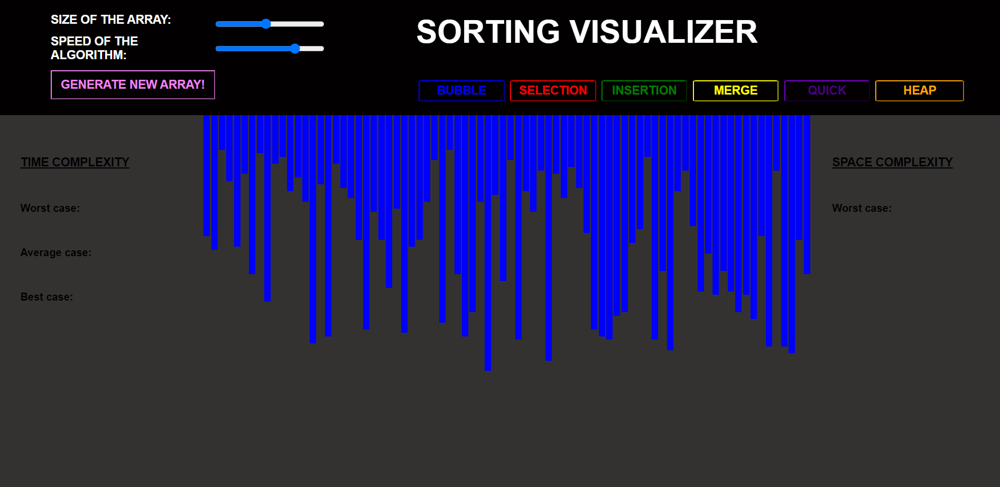

# SORTING VISUALIZER



Sorting visualizer is a web app for visualizing a bunch of different sorting algorithm with the functionality of speed and array size control along with complexity of algorithm (space and time).

## Table of Contents
- [Sorting Algorithm](#sorting-algorithm)
- [Features](#features)
- [Demo](#demo)
- [Technologies Used](#technologies-used)
- [Installation](#installation)
- [Usage](#usage)
- [Contributing](#contributing)
- [License](#license)

## Sorting Algorithm :technologist:

 - Bubble Sorting
 - Selection Sort
 - Merge Sort
 - Insertion Sort
 - Quick Sort
 - Heapify Sort


## Features

- Visualize various sorting algorithms including Bubble Sort, Selection Sort, Insertion Sort, Merge Sort, and Quick Sort.
- Adjustable speed for visualizations.
- Generate arrays of different sizes.
- Responsive design for mobile and desktop use.

## Demo

You can try out the Sorting Visualizer live [here](https://omgupta7352.github.io/Sorting_visualizer/).

## Technologies Used

- HTML5
- CSS3
- JavaScript

## Installation

To run this project locally, follow these steps:

1. Clone the repository:

    ```bash
    git clone https://github.com/omgupta7352/Sorting_visualizer.git
    ```

2. Navigate to the project directory:

    ```bash
    cd sorting_visualizer
    ```

3. Open `index.html` in your preferred web browser.

## Usage

1. Open the application in your web browser.
2. Use the controls to select a sorting algorithm and adjust the speed of the visualization.
3. Generate a new array with a specified size.
4. Click the "Start" button to begin the visualization of the selected sorting algorithm.

## Contributing

Contributions are welcome! If you would like to contribute to this project, please follow these steps:

1. Fork the repository.
2. Create a new branch for your feature or bugfix:

    ```bash
    git checkout -b feature/your-feature-name
    ```

3. Commit your changes:

    ```bash
    git commit -m 'Add some feature'
    ```

4. Push to the branch:

    ```bash
    git push origin feature/your-feature-name
    ```

5. Open a pull request on GitHub.


